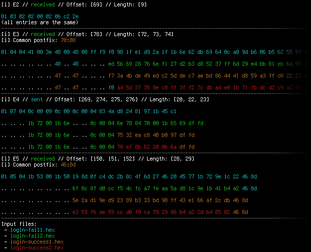

Wireshark Flow tools
====================

These tools can help analyze binary protocols by showing constant bytes in
messages (`flowdiff`) and aiding dynamic analysis with a fake client/server
(`flowfake`). The expected input file format is the one Wireshark outputs
when using `Follow TCP stream` in hex dump mode, and saving it into a file.

Flowdiff
--------

Flowdiff makes it possible to view differences (or find similarities) between
2-4 network flows. The matching flow entries are displayed below each other
in hexadecimal format with different colors. If a byte is the same in all
flows, it's only shown in the first entry, the rest are replaced by `..`
blocks. If a byte is not the same in all flows, but matches one or more
others, it's displayed with the color of the first entry, so it could be
identified visually. The behavior of the tool could be influenced by the
following command line arguments.

 - `-s n` ignores *sent* flow entries with an offset lower than `n`
 - `-r n` ignores *received* flow entries with an offset lower than `n`
 - `-m n` displays only the first `n` flow entries
 - `-t n` displays only the first `n` patterns (fix diff + match)
 - `-d foo.bar` applies `bar()` from module `foo` to all data for decoding
 - `-f rules` fragment packets at manual boundaries, rules are separated by
   commas, and each consists of a letter for direction (`s` or `r`) followed
   by a decimal or hexadecimal offset (example: `s0x34,r412,r234`)

Flowfake
--------

Flowfake makes it possible to create a dumb but simple fake client or server
in no time, based on captured network flow. It could be used to replay the
same traffic multiple times to gather distinct responses for further analysis.
The logic used is really basic, it parses the flow, and if an entry was sent,
it sends it, if an entry of `n` bytes should be received, it waits till `n`
bytes are received. Server or client functionality could be selected using
command line arguments.

 - `-c hostname n` connects to `hostname` on TCP port `n`, sends traffic *sent*
   in the original flow, and expects traffic *received* in the original flow
 - `-s n` listens on TCP port `n`, sends traffic *received* in the original
   flow, and expects traffic *sent* in the original flow

License
-------

The whole project is available under MIT license.

Dependencies
------------

 - Python 2.7 (tested on 2.7.9)
 - Blessings https://github.com/erikrose/blessings (for `flowdiff` only)
